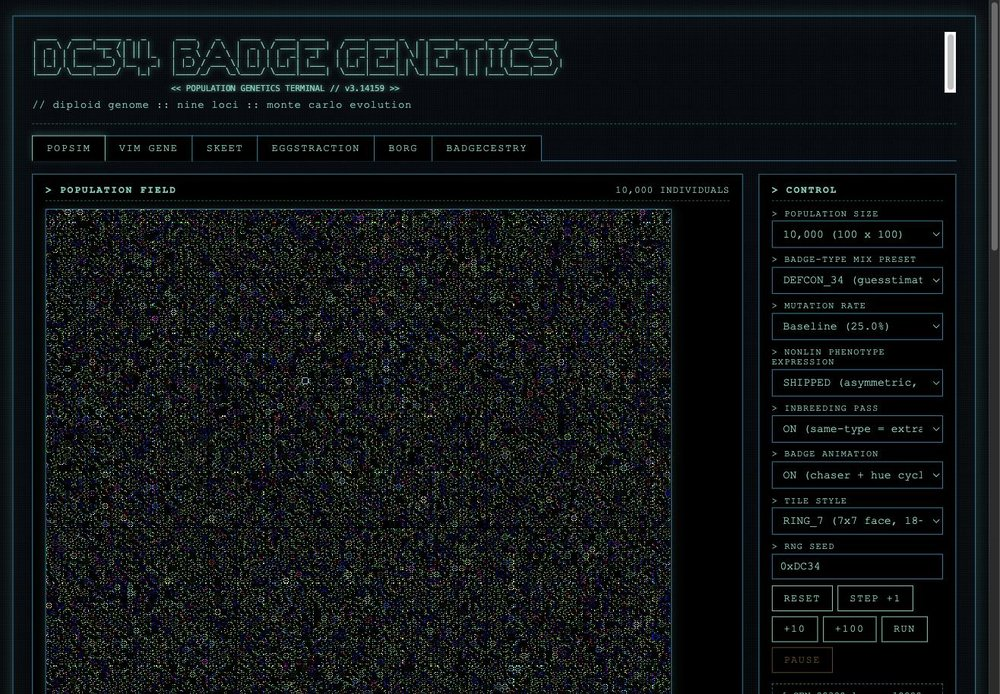
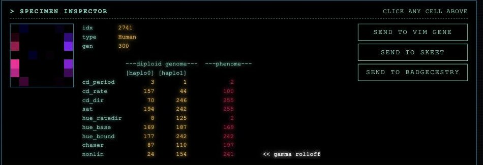
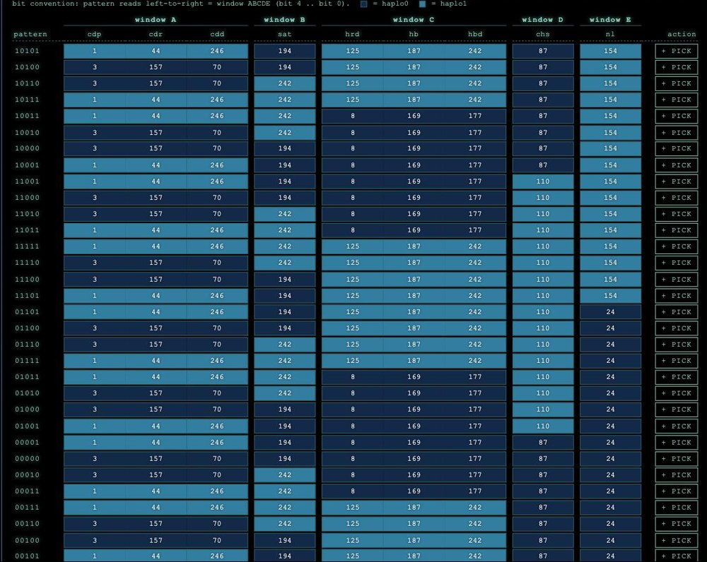
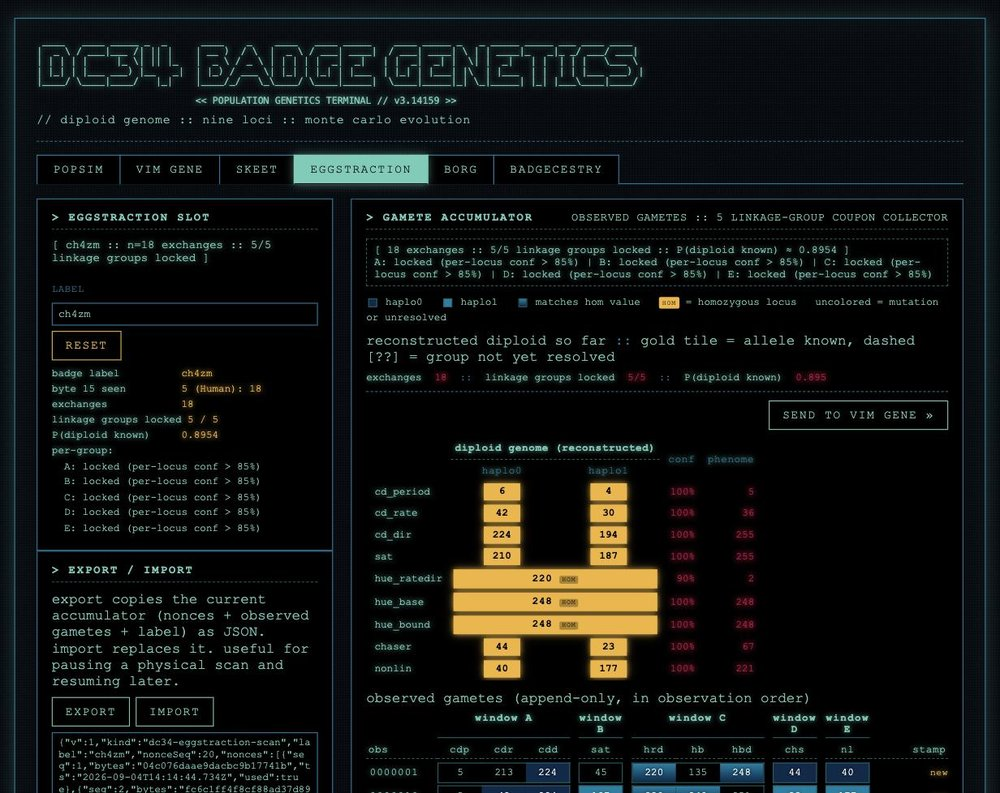
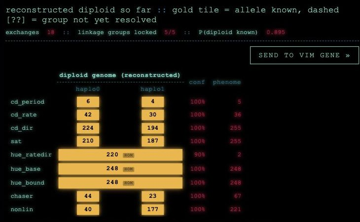

# FAQ

- [What is dc34sim?](#what-is-dc34sim)
- [Using the simulator](#using-the-simulator)
- [Skeet](#skeet)
- [Badgecestry](#badgecestry)
- [Eggstraction](#eggstraction)
- [Your physical badge](#your-physical-badge)
- [Under the hood](#under-the-hood)
- [Related repositories](#related-repositories)

---

## What is dc34sim?

A browser simulation of the DEF CON 34 badge's population-genetics system:
10,000+ virtual badges evolving in your tab, plus a widget that can talk to
your physical DC34 badge over the QR exchange. See
[`synthetic-population-genetics.md`](synthetic-population-genetics.md).

dc34sim is a console with six tabs across the top. Each is a different
lens on the same genetics core:

- **popsim** - evolve a whole population of badges. Click any cell to inspect it.
- **vim gene** - edit one badge's genome (a diploid: 2 x 9 bytes) and mint QRs a real badge will accept.
- **skeet** - take one diploid and enumerate every gamete it can produce (all 32), then seal one for a real badge to accept.
- **borg** - same as popsim, but every mating uses one frozen partner, ROOT.
- **badgecestry** - decode one badge's ancestry composition with a two-stage hidden Markov model.
- **eggstraction** - non-destructively read a physical badge's diploid by collecting enough of its sealed gametes.

### Do I need a camera?

No. Nothing on the page needs a camera, and everything is click-driven. To
bring in a physical badge, you read the badge's screen with your own phone or
a QR reader app, then paste the text into the widget.

See [Your physical badge](#your-physical-badge) below.

## Using the simulator

### What's the difference between popsim and borg?

popsim simulates a free-mixing population of badges. Each generation, any
badge mates with any other at random.

borg runs the same simulator as one big colony: every badge mates with the
same fixed partner, ROOT, a frozen diploid. It's the social-insect colony
setup, one individual as the mate for everyone, so ROOT's genome spreads
through the colony until, without mutation, every badge is ROOT. See
[`borg-genetics.md`](borg-genetics.md).

### How do I evolve a population?

1. Open the **popsim** tab.
2. In the **control** panel (right side), set a population size and mutation rate.
3. Press **run** to evolve continuously, or **step +1** / **+10** / **+100** to advance one generation at a time.

See [`synthetic-population-genetics.md`](synthetic-population-genetics.md)
section 5 (mutation) and section 7 (mating).



### How do I select and inspect a simulated badge?

popsim and borg simulate badges (and the firmware running them) entirely in
the browser, so you can see and control the exact state of any individual.
On either tab, click a cell in the population grid. Its genome and phenotype
show up in the specimen inspector right below the grid.

The inspector is the hub between tabs: any badge you select can be sent
straight to **vim gene** to edit, to **skeet** to enumerate its gametes, or
to **badgecestry** to decode. So the whole pipeline is: pull a gene out of a
popsim run, send it to vim gene, edit it, and borg draws its frozen ROOT
from the vim gene state.



### What do the allele-frequency histograms mean?

On the **popsim** tab (or **borg**), the **allele frequency spectra** panel
sits below the specimen inspector. Each histogram there is the live
distribution of one phenotype - hue, saturation, chaser, and so on - across
the whole population at this moment. See
[`synthetic-population-genetics.md`](synthetic-population-genetics.md)
section 9, "What To Measure".

### How do I send a specimen to vim gene?

The specimen has to be selected first, in either popsim or borg:

1. Open the **popsim** tab (or **borg**).
2. Click a cell in the population grid to select a badge. Its details appear in the specimen inspector below the grid.
3. In the inspector, press **send to vim gene**.
4. Switch to the **vim gene** tab. The badge is loaded into the diploid editor, ready to edit or export as a QR.

See [`gene-exchange.md`](gene-exchange.md) PHASE 0.

### How do I swap haplo0 and haplo1, and why would I?

In the **vim gene** editor, the **swap haplo0 ↔ haplo1** button exchanges the
two strands. It exists to expose the shipped `nonlin` asymmetry: the same two
haploids in opposite roles usually produce a different displayed phenotype.
See [`synthetic-population-genetics.md`](synthetic-population-genetics.md)
section 4.1.

## Skeet

### What is skeet?

Skeet takes one diploid badge and enumerates every gamete it can produce.
With 5 linkage groups and fair independent coins, that's exactly `2^5 = 32`
distinct gametes, and skeet shows all 32 at once - no sampling, no RNG, no
re-roll. It's meiosis-as-a-truth-table: masturbation, not mating. One
organism in, its full gamete space out. See [`skeet.md`](skeet.md) for the
full write-up and
[`synthetic-population-genetics.md`](synthetic-population-genetics.md)
section 3 for the linkage groups.

### How is skeet different from vim gene?

vim gene edits a diploid and mints **one** gamete on demand (a random draw
from the badge's possible gametes). Skeet is read-only and shows **all 32**
possible gametes at once, so you can pick exactly the one you want to seal
into a QR. Vim gene is the editor; skeet is the exhaustive enumerator.

### How do I send a badge to skeet?

Same pattern as sending to vim gene: any specimen inspector (popsim, borg,
vim gene) has a **send to skeet** button. Click a cell in the grid, press
send, and the skeet tab loads with that badge in its slot. Sending is a
snapshot - later edits in vim gene do not retroactively update the skeet
slot; re-send if you want to sync.

### How do I read the 32-gamete grid?

Panel B has 32 rows, one per coin pattern. Each row shows:

- a **5-bit pattern label** (e.g. `10110`) telling you which linkage groups
  came from haplo1 vs haplo0,
- **9 boxed cells**, one per locus, colored by source haploid (haplo0 vs
  haplo1) so you can see the linkage blocks at a glance, and
- a **`+ Pick`** button at the end of the row.

Cells within the same linkage group co-segregate - they always share the
same source color in a given row. If both haploids happen to be identical
at a group's loci, the two patterns that differ only in that bit produce
byte-identical gametes; skeet shows both rows anyway (deliberate - the view
is "all 32 mathematically possible patterns," not "unique gametes").

Row order is randomized once per loaded organism and held stable while you
compare and pick, so the layout doesn't jump under you between renders.
Sending a different badge triggers a fresh shuffle.



### How do I pick a gamete?

Click **`+ Pick`** on the row you want. That reveals Panel C (the QR
exchange) and loads the picked gamete's 9 bytes as the seal payload. Only
one gamete can be picked at a time; clicking `+ Pick` on a different row
swaps the picked gamete (and invalidates any prior seal). Clicking `+ Pick`
on the already-picked row unpicks and hides Panel C.

### How do I seal a gamete on the skeet tab (nonce and seal)?

Panel C mirrors vim gene's QR gene exchange, minus the "gamete source"
picker (the source *is* the row you picked). Same three-phase flow as
[`gene-exchange.md`](gene-exchange.md):

1. **k** - shared with vim gene. Edit it on either tab and both stay in sync.
2. **phase 1** - your physical badge shows its phase-1 QR. Scan it with
   your phone, paste the decoded string into the box, and press **extract
   nonce**. Skeet keeps its own parsed nonce separate from vim gene's, so a
   phase 1 done elsewhere doesn't silently pre-fill here.
3. **phase 2** - pick a **byte 15 :: badge type override** (defaults to
   the parent diploid's badge type) and press **seal**. It produces a QR
   your badge will accept as a mate, with the picked gamete as the mate's
   contribution.
4. **phase 3** - press **decode phase 2** to round-trip the sealed bytes
   back to a haploid preview, so you can verify the recovered bytes match
   the gamete you picked.

The parent diploid in skeet is the **responder** in the exchange; your
physical badge is the **receiver**. The gamete you sealed becomes slot 0 of
the receiver's new diploid.

## Badgecestry

### What is badgecestry?

It decodes a single badge's ancestry composition - which founder badge types
its genome descends from - using the two-stage hidden Markov model from U.S.
Patent 12,626,778 (the technique AncestryDNA uses). See
[`badgecestry.md`](badgecestry.md).

### How do I load my own gamete? (jizz in a cup)

In the **badgecestry** tab, use the **load from gamete** panel (top left):

1. Press **generate nonce**, then scan that QR with your badge.
2. The badge seals its gamete under that nonce and shows a second QR.
3. Scan the second QR and paste its text into the box.

Leave the box empty to use the provided genome.

This is where a physical badge differs from the simulated ones. popsim and
borg simulate badges in the browser, so you can inspect a whole diploid - both
haploids - directly. A real badge has no way to hand over its full genome.
There's no "here are my two strands" command. It can only mint a gamete: a
random new haploid assembled from those two strands. So loading your own
gamete is asking the badge to jizz in the cup and hand back one randomized
strand, not dump its whole genome.

<!-- SCREENSHOT: the load-from-gamete panel with the two QRs -->

### What does the "generations since founding" slider do?

It sets t, the number of generations of mutation since the founding
population. Drag it up and the ancestry signal decays. See
[`badgecestry.md`](badgecestry.md) section 4.6.

## Eggstraction

### What is eggstraction?

Eggstraction is a non-destructive readout of a physical DC34 badge's full
diploid. The badge has no "print my genome" command - the only thing it will
hand out is one meiosis-sampled gamete per exchange. Point enough minted
nonces at the badge, collect enough sealed gametes, and the underlying two
haploids fall out of the accumulated statistics. Stock firmware, no JTAG, no
debugger, just the QR protocol the badge already speaks. See
[`eggstraction.md`](eggstraction.md).

Sister to skeet: skeet is the forward map (one diploid -> all 32 possible
gametes at once), eggstraction is the inverse map (observed gametes -> the
diploid that produced them).

### Do I need a physical badge for the eggstraction tab?

Yes. Unlike every other tab, eggstraction is exclusively about physical
badges - there is no simulated counterpart. Without a real badge in your
hand, the tab does nothing useful.



### How do I run a scan?

1. Open the **eggstraction** tab and give your badge a **label** (top-left
   panel) so you don't accidentally mix its scans with another badge's.
2. In the **QR gene exchange** panel (right), phase 1, press **MINT NONCE**.
   The widget draws a QR.
3. Show the QR to your badge's camera. The badge meioses a gamete under its
   own diploid and displays a sealed phase-2 QR on its OLED.
4. Scan the badge's screen with your phone or a QR reader app, copy the
   decoded base45 text, paste it into the phase-2 textarea, and press
   **open & record**.
5. The gamete lands in the **gamete accumulator** (right), the coverage
   line updates, and the reconstructed diploid so far is displayed above.
6. Press **MINT NEXT NONCE** and repeat. Batch mode: mint several nonces
   at once and paste multiple sealed strings, one per line.

See [`eggstraction.md`](eggstraction.md) section 10.

<!-- SCREENSHOT: phase 1 minted nonce QR shown on the widget -->
<!-- SCREENSHOT: phase 2 textarea with a sealed base45 string pasted -->

### How many exchanges do I need?

Rules of thumb, from [`eggstraction.md`](eggstraction.md) section 5.2:

- **~6 exchanges**: about 85% of linkage groups locked on a typical
  heterozygous badge.
- **~10 exchanges**: usually 99% locked and the coverage line reads
  "diploid known" for a badge with no unusual structure.
- **15+ exchanges**: needed when a lot of linkage groups are homozygous,
  because you're waiting on Gray-neighbor evidence to sort out.

### What does the coverage line at the top mean?

The line above the gamete rows reads something like:

```
[ 8 exchanges :: 4/5 linkage groups locked :: P(diploid known) ≈ 0.71 ]
```

- **`n exchanges`** - raw gamete count in the log.
- **`K/5 linkage groups locked`** - groups whose loci all cleared the
  per-locus confidence threshold of 0.85, after phasing and tuple-consensus
  overrides.
- **`P(diploid known)`** - product of per-locus posterior confidences.
  Conservative chained-AND bound.

See [`eggstraction.md`](eggstraction.md) sections 5 and 8.

### Why is the reconstruction "mutation-aware"?

Every gamete the badge emits has been through one Baseline mutation pass on
the way out. So any observed byte is the true value 75% of the time and one
of its eight Gray-1 neighbors 25% of the time. You cannot read a single scan
as identity. The estimator scores every candidate `{v0, v1}` pair per locus
against the observed histogram and reports a proper softmax posterior. See
[`eggstraction.md`](eggstraction.md) sections 3, 4, and 5.

### What is a HOM tag in the reconstruction?

A linkage group is **homozygous** if the estimator's argmax has `v0 == v1` -
both haploids carry the same value there. Those cells render with a **HOM**
tag and both haplo0 and haplo1 boxes show the same value in the "matches
hom" swatch color. Homozygous groups are the sticky case: there is no
"other allele" to observe, so it takes more scans to reject the alternative
that the badge is heterozygous with a Gray-neighbor. See
[`eggstraction.md`](eggstraction.md) section 7.

### Can I send an eggstracted badge into the sim?

Yes - that's the point. Once the reconstruction is coherent enough, the
**send to vim gene** button (top of the reconstructed-diploid header) is
enabled. Click it and the estimator's ordered `(haplo0, haplo1)` per-locus
representative is loaded into vim gene, from which you can phenotype it,
edit it, feed it to borg as ROOT, or draw sim gametes off it. Eggstraction
is the bridge from atoms to bits.



### Can I pause a scan and resume later?

Yes. The **export / import** panel (top-left) copies the whole accumulator
- nonces, observed gametes, label - as a JSON blob. Press **export**, then
**copy export to clipboard**, and stash the text anywhere. To resume, paste
into the same textarea and press **load import**. This replaces the current
slot, so label your exports.

### What does "reset" do, and when should I use it?

**reset** wipes the current accumulator (nonces, observed gametes, label).
Do this between different physical badges. The tab does not detect mid-scan
badge switches - if you feed it gametes from two different badges under one
label, it will happily mix them and produce a nonsense reconstruction. See
[`eggstraction.md`](eggstraction.md) section 9.

## Your physical badge

### Do I need a DEF CON 34 badge to use dc34sim?

Certainly not required, but if you do have one, the site can interact with it
via QR code exchanges!

Simulation, editing, and badgecestry all use virtual badges.

### What is k0, and where do I get it?

k0 is the published default badge secret that encrypts the QR exchange. The
widget ships with it pre-loaded. See [`gene-exchange.md`](gene-exchange.md)
("Where k0 sits").

### How do I generate a nonce?

On the receiving badge (the one that will evolve):

1. On your badge, press left or right until it shows its phase-1 QR.
2. Scan that QR with your phone and copy the text it decodes to.
3. In the **vim gene** tab, open the **QR gene exchange** panel, phase 1, and paste the string.
4. Press **extract nonce**.

See [`gene-exchange.md`](gene-exchange.md) PHASE 1.

### How do I seal a gamete?

In the **QR gene exchange** panel, phase 2: choose a gamete source and press
**seal**. It produces a QR your badge will accept as a mate. See
[`gene-exchange.md`](gene-exchange.md) PHASE 2.

### What do I scan, and with what?

Your badge scans the QRs the widget draws. You scan your badge's screen with
your own phone/device, and copy-paste the QR code contents into the widget.
There is no camera on the page. See [`gene-exchange.md`](gene-exchange.md) PHASE 3.


## Under the hood

Quick definitions only. Each term links to the document with the real math.

### What is a haploid / haplo0 / haplo1?

A haploid is one strand of the genome (9 bytes). A diploid is two strands,
haplo0 and haplo1, and every badge is diploid. See
[`synthetic-population-genetics.md`](synthetic-population-genetics.md)
section 1.

### What is the genome / "the nine loci"?

Each badge has a "genome" that consists of nine one-byte loci
(each a 0-255 integer value). What genes you have is called
your "genotype."

The visible flashing LED pattern on the badge is the expressed
result of the genes. What pattern is expressed via the genes
is called your "phenotype."

See [`synthetic-population-genetics.md`](synthetic-population-genetics.md)
sections 1 and 4.

### What is mutation?

A per-locus chance to flip bits in a gamete (Gray-coded), set by the mutation
meter from Baseline up to Apocalyptic. See
[`synthetic-population-genetics.md`](synthetic-population-genetics.md)
section 5.

### What is the "inbreeding pass"?

When two mating badges share a badge type, both gametes take an extra
mutation pass - an assortative-mating penalty. See
[`synthetic-population-genetics.md`](synthetic-population-genetics.md)
section 6.

### What is the "nonlin" anomaly?

The shipped firmware expresses the nonlin phenotype asymmetrically (one
parent's chaser allele shows up in the other's nonlin). It shouldn't work, but
it ships anyway. See
[`synthetic-population-genetics.md`](synthetic-population-genetics.md)
section 4.1.

### What does "ROOT" mean?

ROOT is a frozen diploid used as the fixed partner in every borg mating, so
its genome steadily spreads through the colony. See
[`borg-genetics.md`](borg-genetics.md).

## Related resources

- [`bunnie/dc34-api`](https://github.com/bunnie/dc34-api) - genetics core: `Haploid`, `Diploid`, `BadgeType`, `phenotype`, `meiosis`, `mutate`.
- [`bunnie/dc34-vault`](https://github.com/bunnie/dc34-vault) - exchange state machine and the k0 oracle.
- [`bunnie/dc34-console`](https://github.com/bunnie/dc34-console) - LED renderer.
- [`nastea1/dc34-gamete`](https://github.com/nastea1/dc34-gamete) - QR wire format (`PROTOCOL.md`), published k0, and the reference workbench.
- [U.S. Patent 12,626,778](https://patents.justia.com/patent/12626778) - "Accelerated hidden Markov models for genotype analysis".
