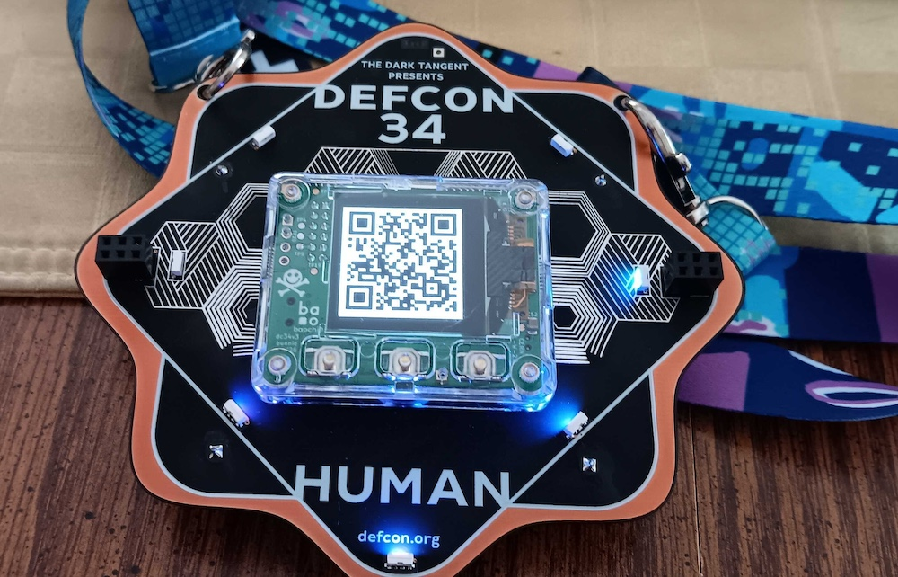
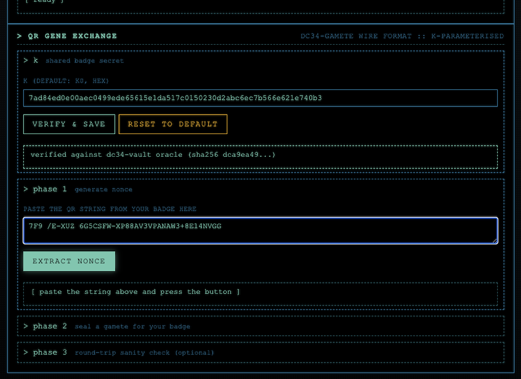
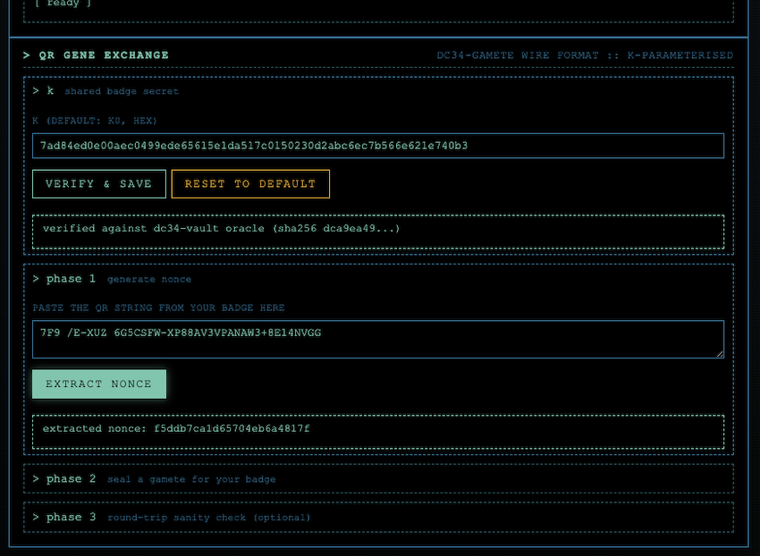
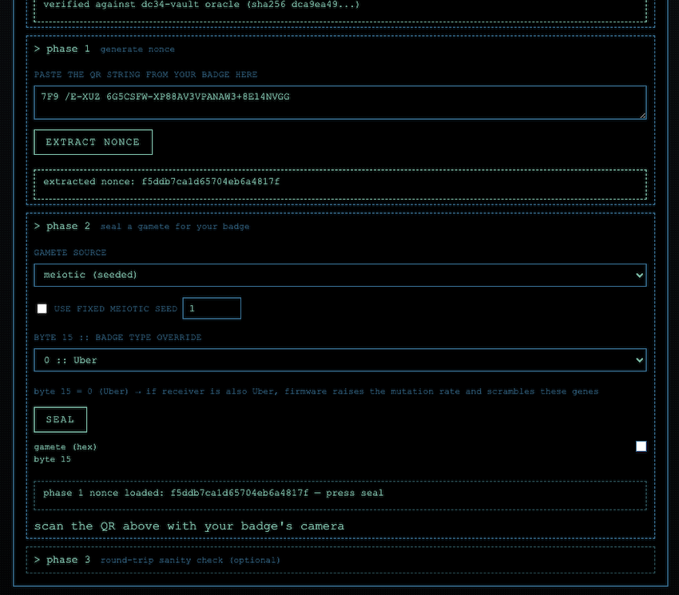
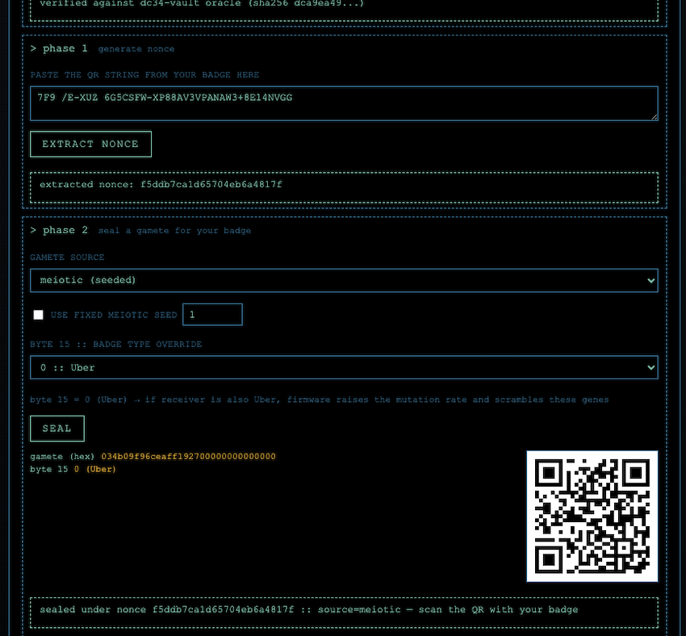
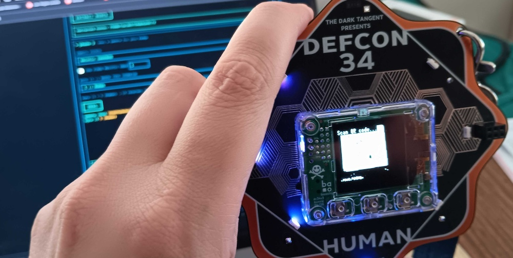
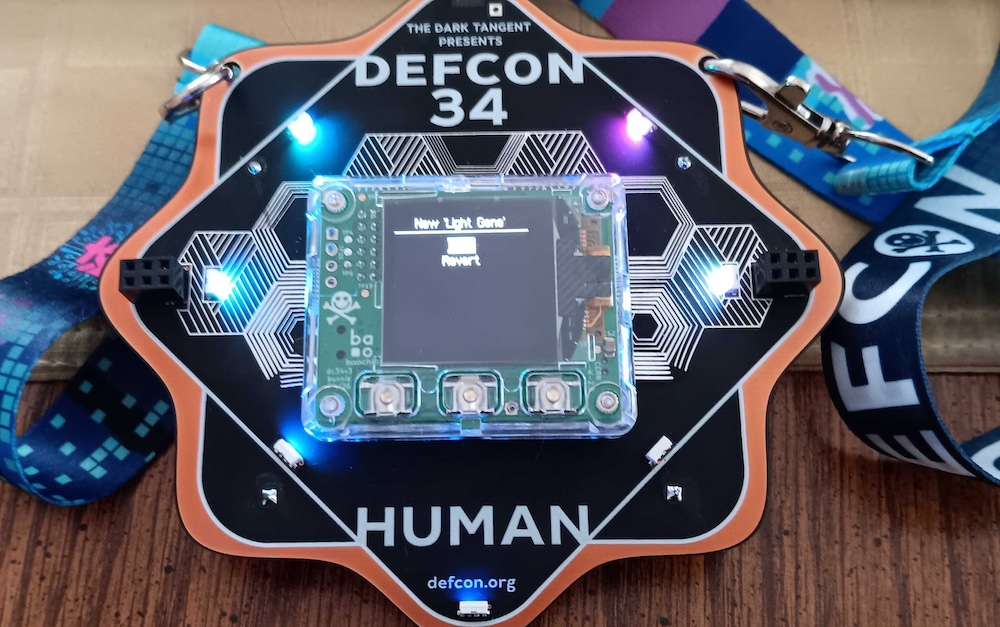
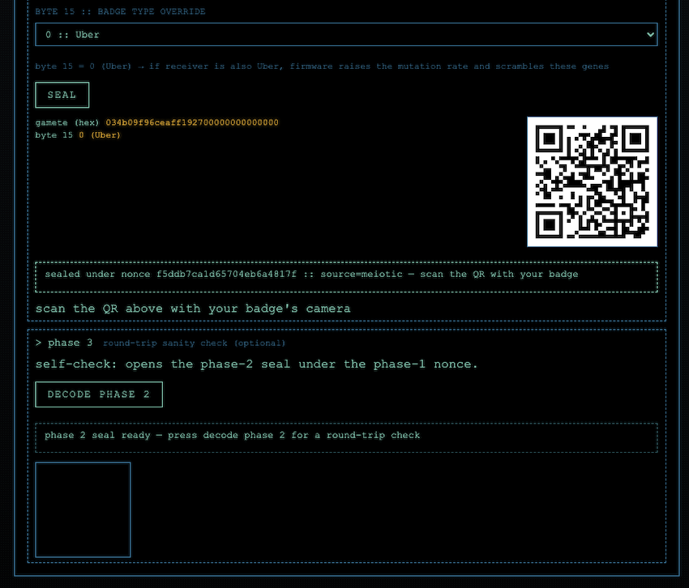
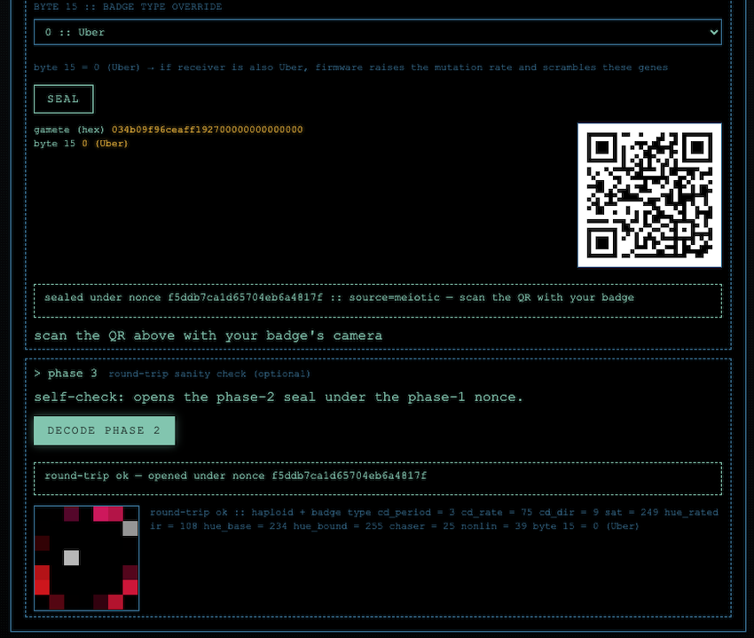

# GENE EXCHANGE

How to design a genome in the vim gene tab and get your physical DEF CON 34
badge to mate with it. Covers the two-QR protocol, the crypto behind it, the
role of `k0`, and the "k9000" idea of forking your own genetically isolated
population.

Related:
[`nastea1/dc34-gamete/PROTOCOL.md`](https://github.com/nastea1/dc34-gamete/blob/main/PROTOCOL.md) — the wire format spec, byte-by-byte.
[`bunnie/dc34-vault`](https://github.com/bunnie/dc34-vault) — the firmware side of the exchange.

---

## The one-page procedure

**Goal**: sculpt a genome in vim gene, produce a QR your badge will accept as
a mate, watch your badge's LEDs update.

You need: your DC34 badge (unmodified stock firmware is fine), this sim
running in a browser on a screen big enough to hold a QR, and a phone or
QR-scanner app.

The panel titled **> QR gene exchange** has three collapsed sections. You
work them top to bottom, one button per section.

### PHASE 0: Design your mate in vim gene

Fill the diploid editor above the panel with the genome you want the *mate* to have. Homozygous (both haplo0 and
haplo1 identical) if you want a deterministic gamete; different strands if you want meiosis to coin-flip per locus.

(Alternatively, if you find a badge that you like during a population simulation/borg simulation, you can select
the badge and click "Send to vim gene" in the specimen inspector.)

This is the only "design" step — everything after this is button-pressing.

### PHASE 1: Generate nonce

On the receiving badge (this is the badge that will evolve; wording assumes this is _your_ badge),
generate a nonce:

1. On your badge, press left or right to display its phase-1 QR.
2. Scan that QR with your phone's camera or a QR reader app.
3. Copy the text it decoded to (it looks something like
   `7F9 /E-XUZ 6G5CSFW-XP88ANWB*VRYAMQXGO$9BE9` — 42-ish characters,
   spaces are part of it, do not strip them).
4. Paste that whole string into the phase-1 text area.
5. Press **extract nonce**. The status line will read
   `extracted nonce: XX XX ...`.



The QR code above decodes to:

`7F9 /E-XUZ 6G5CSFW-XP88AV3VPANAW3+8E14NVGG`

Paste the extracted nonce into the text box in vim gene and click
"Extract Nonce" button:





### PHASE 2: Seal a gamete for your badge

In vim gene, you will use the k0 key and the nonce you just generated to seal
a gamete (the part of the genome that's going to combine with yours) and generate
the QR code that you'll scan:

1. Pick a **gamete source**. `meiotic (seeded)` is the sane default: it
   draws a fresh coin-flip gamete from the vim diploid. `haplo0` or
   `haplo1` sends that strand verbatim (useful when you built a
   homozygous mate and want reproducibility).
2. Pick **byte 15 (badge type)**. `7 :: None` is the safe universal answer — it
   suppresses the inbreeding mutation pass on any receiver. Or pick any
   badge type that is **not** the same as your physical badge's, if you
   want the seal to look "in the world." Deliberately picking your own
   type triggers the elevated (~39%) inbreeding mutation rate, which is
   almost never what you want.
3. Press **seal**. A QR appears.





### PHASE 3: Scan the QR with your badge

Your badge will still be in phase-2-waiting from step 2.1.

It should scan, open under its own nonce and k0, get the mate's haploid,
run meiosis, syngamy, mutate, and express. You should see the new pattern
appear on the badge, plus an option to keep or discard the new pattern.





### (OPTIONAL) PHASE 4: Round trip sanity check

As a browser-only sanity check, you can press **decode phase 2**.
This will open the phase 2 seal that was just created, using the
same phase 1 nonce that was used to create the seal.

If everything works as expected, the phase 1 nonce and phase 2 seal
can be used to recover the haploid from the badge shown in vim gene.
It should round-trip cleanly, and show the same badge as the main
one selected in the vim gene tab. It should round-trip cleanly. If
it does, but your badge still rejects the QR, the problem is badge-side
(state, camera focus, badge rotated its nonce, badge has wrong key value),
not with vim gene.





---

## What just happened

The DC34 exchange is asymmetric: **only one badge's genome updates per
mating**. That badge is the *receiver*. In the recipe above your physical
badge is the receiver, and the vim gene panel is the *responder* — it
supplies a gamete but doesn't itself change.

Two QRs, in this order:

```
      YOUR BADGE (receiver)             VIM GENE PANEL (responder)
      ---------------------             --------------------------
  1.  generate nonce
      show QR on OLED  --------------->  paste into phase 1
                                         extract nonce
                                         mint gamete from vim diploid
                                         seal(k0, badge_nonce, gamete)
                                  <----- show sealed QR on screen
  2.  scan sealed QR
      open under own nonce + k0
      -> get vim gene's haploid
      run own meiosis to get an egg
      combine: (vim haploid, egg) -> new diploid
      apply mutation (elevated if inbreeding)
      express phenotype -> new LEDs
      keep or revert
```

For your badge to *give* a gamete to another badge (or to the panel, if you
want to model the reverse direction), you swap the roles: the other side
generates the nonce, your badge scans it and seals. Two full exchanges to
change both badges.

### What "syngamy" means here

Real biology: sperm + egg → zygote. Here the receiver plays egg-carrier:

- The **haploid the responder sent** becomes slot 0 of the receiver's new
  diploid.
- The **receiver's own fresh meiotic gamete** (drawn from its current
  diploid at the moment of scan) becomes slot 1.

New diploid = `(responder's haploid, receiver's own gamete)`. Then per-locus
mutation, then phenotype expression per `synthetic-population-genetics.md`
§4, then the ring updates.

### Byte 15 (Badge Type) and the inbreeding pass

The sealed 16-byte plaintext:

```
plaintext[0..9]   = 9 gene bytes (the haploid)
plaintext[9..15]  = 0x00 * 6     (padding)
plaintext[15]     = sender's badge type
```

If the sender's badge type equals the receiver's own, the firmware calls it
inbreeding and raises the mutation rate before applying it. See
`synthetic-population-genetics.md` §5 (`RATE_VALUE`, `RATE_BITS`). Byte 15 =
`7` (None) never trips this on any receiver, which is why it's the panel's
safe default.

### Caveats worth naming

- **You supply half the resulting diploid, not the whole thing.** The
  receiver contributes its own gamete via its own meiosis. A wide hue band
  from the mate lands in a single exchange (both `hue_base` min and
  `hue_bound` max rules pull toward the extremes), but a rare `chaser < 88`
  usually does not, because the receiver's own egg almost certainly has
  `chaser >= 88` and the expression rule is a saturating add. Expect
  several exchanges to fix a rare trait.
- **Mutation can undo your careful sculpting.** Even Baseline (~25% per
  locus) is a lot. If a specific gene matters, send it as a homozygous
  haploid and avoid tripping the elevated inbreeding pass on byte 15.
- **The panel doesn't emulate the receiver.** Phase 3's decode shows the
  haploid you would send, not the diploid your badge ends up with after
  syngamy + mutation. To model that side too, use the popsim or borg tab
  and run one generation of a two-individual population.

---

## The underlying cryptography

Only two primitives ship over the air:

- **base45** (RFC 9285) — how the raw bytes become text a QR can carry in
  Alphanumeric mode. Alphanumeric mode is one QR version smaller than byte
  mode for the same payload, meaning larger modules and a better scan.
- **AES-256-GCM-SIV** (RFC 8452), key = `k0`, nonce = the badge's phase-1
  nonce. Only the phase-2 sealed gamete uses this; phase-1 is transmitted
  in the clear (header + 12 random bytes).

Both are implemented in JavaScript in the vim gene QR panel and in
[`gamete-workbench.html`](https://github.com/nastea1/dc34-gamete/blob/main/gamete-workbench.html);
neither depends on WebCrypto, so the whole thing works from a file opened
straight off disk.

**Why GCM-SIV specifically:** the "SIV" (Synthetic Initialization Vector)
variant is nonce-misuse resistant. Ordinary AES-GCM catastrophically fails
under nonce reuse — an attacker who sees two ciphertexts under the same
`(key, nonce)` pair can recover the authentication key and forge messages.
GCM-SIV downgrades gracefully instead: reusing a nonce merely leaks whether
the two plaintexts were identical. Given the DC34 nonce is only 96 bits
(2⁻⁴⁸ birthday collision) and any given badge exchanges many gametes in a
weekend, SIV is the honest choice.

### Where `k0` sits

`k0` is a single global 32-byte key shared by **every** DC34 badge on Earth.
It is not per-device. It doesn't identify who you are. It just says "the
sender was some DC34 badge." Two consequences:

- One badge's copy unlocks the protocol for all of them. That is exactly
  the weakness [`nastea1/dc34badge`](https://github.com/nastea1/dc34badge)
  exploited to publish the value.
- No key rotation, no revocation. Authenticity in this scheme proves "some
  DC34 badge, somewhere," never *which* badge.

The badge firmware carries a hardcoded prefix of `sha256(k0)` — the eight
hex chars `dca9ea49` at `dc34-vault/src/main.rs:42` — used by each badge to
validate its own key material. The panel's k row runs the same check when
the input is the default value; a custom key is accepted with a warning
that the oracle didn't match.

The published `k0`:

```
7ad84ed0e00aec0499ede65615e1da517c0150230d2abc6ec7b566e621e740b3
```

It only protects the gene exchange. The vault's stored credentials
sit under a separate per-device key and are not affected by `k0` leaking.

---

## k9000 — forking your own genetically isolated population

`k0` is a parameter, not a constant. The whole exchange works under *any*
32-byte key; `k0` is just the one bunnie's firmware happens to accept. Pick
any other 32 bytes — call it `k9000` — and you have a fully working
DC34-style population that is **genetically incompatible with real DC34
badges**:

- A `k9000` seal cannot be opened under `k0`. GCM-SIV's tag fails.
- A `k0` seal cannot be opened under `k9000`. Same reason.
- Everyone running your vim gene panel with `k9000` in the k slot can
  trade gametes with each other; none of it touches or is touched by the
  DC34 population.

Useful for:

- Modeling founder-effect / island-population dynamics where two colonies
  drift apart, and only occasionally does a migrant appear (someone with
  both keys who manually shuttles a haploid across).
- Home laboratory breeding experiments where you don't want test mutants
  escaping the lab and leaking into the general (conference) population.

To use one: paste your 64 hex chars into the panel's k row and press
verify & save. The oracle check will fail (that's expected — it's not
`k0`), and the status line will say *custom k accepted; oracle not
checked*. Everyone in your colony uses the same custom key.

No physical hardware required for a k9000 colony, but note that real
badges can't have their `k0` swapped without reflashing the firmware.

